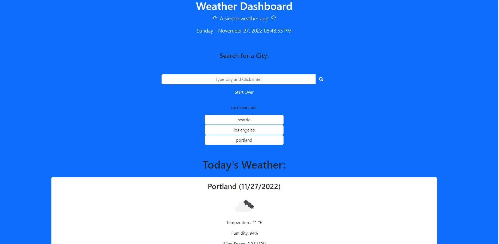

# Module6Challenge
# Module6Challenge - Server-Side APIs Challenge: Weather Dashboard

## Description

Bootcamp: Module 6 Challenge  
Server-Side APIs Challenge: Weather Dashboard  
Codebase correction that follows accessibility standards so that the site is optimized for search engines

## Table of Contents (Optional)

N/A

## Installation

Github pages hosting: https://fjnelson.github.io/Module6Challenge/

## Usage

## Credits

Credit for contribution: 
Sylvia Prabudy - June 28, 2020
https://github.com/sylviaprabudy/weather-dashboard

Credit for contribution:
Mei Tu - January 27, 2021
https://github.com/mmeii/weather-dashboard

## License

Please refer to the LICENSE in the repo.